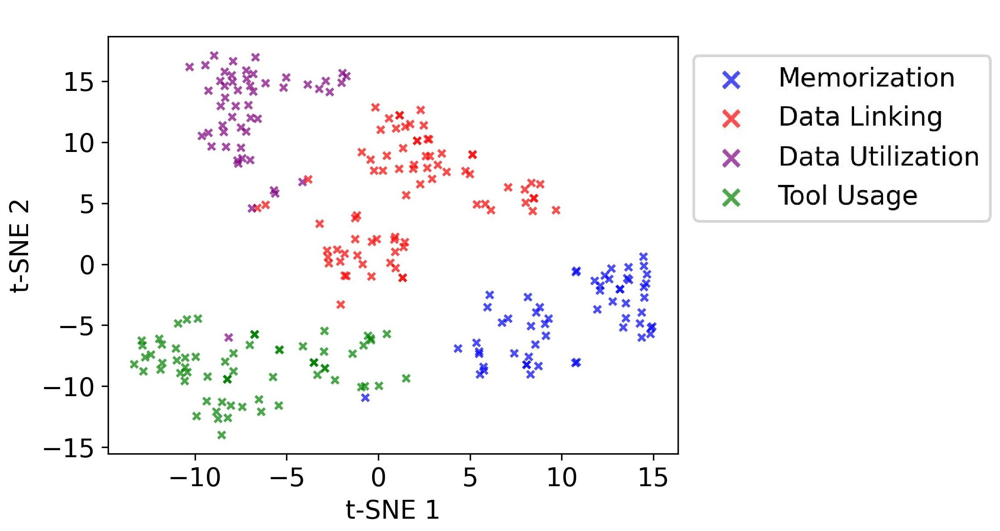

__Muroran IT: "Understanding Student Learning Behavior: Integrating Self-Regulated Learning Approach and K-means clustering"__

**Experimentation**
We gathered students profile information from 215 thai high level students using a E-Learning web application. The experiment involved recognizing color patterns on resistors and calculating their corresponding resistance values. Eight different resistors (R1 to R8) were used, and students were provided with options to select the true/correct color patterns for each resistor. After selecting the appropriate color patterns, students calculated the resistance values based on the chosen patterns. Different approaches could be utilized like hint that assist for the calculations as a reference. The participants was also allowed to use other web application for the experiment. All the information about the time taken to do each activities was automatially saved in the log file in the cloud server.  

    

    

**Learning Patterns**
 After collecting the time datasets and navigation frequency for each student, we classified the data into six categories: consistency score, interval score, response score, page frequency, hint count, and note-taking frequency. 

 **Behavior categorization**
After analyzing the collected datasets and identifying various patterns, we categorized these patterns into four distinct strategies: memorization, data utilization, tool usage, and data linking. 

**Implementation**
We collected all the information automatically through log file. Here, we have provided the Demo_KNN inside src folder. We used the datasets of Demo_KNN to analyze the students behaviors into four categorization through K-Means which the code is available in Analyzer_SRL.ipynb inside src folder. This code is support by python 3.7 and above.
